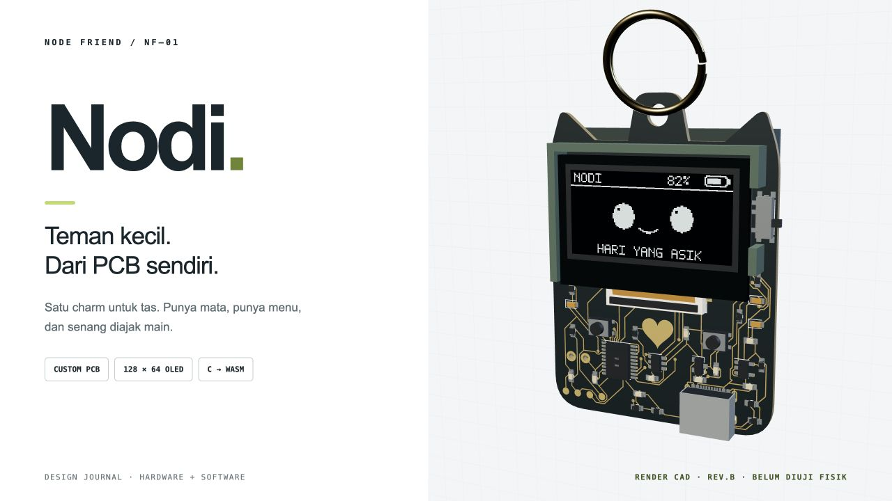
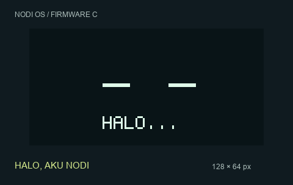
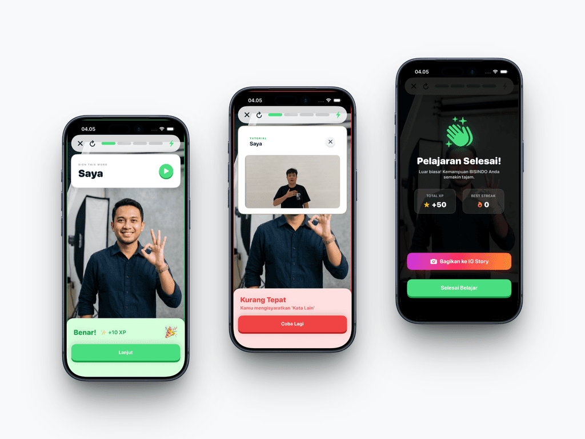
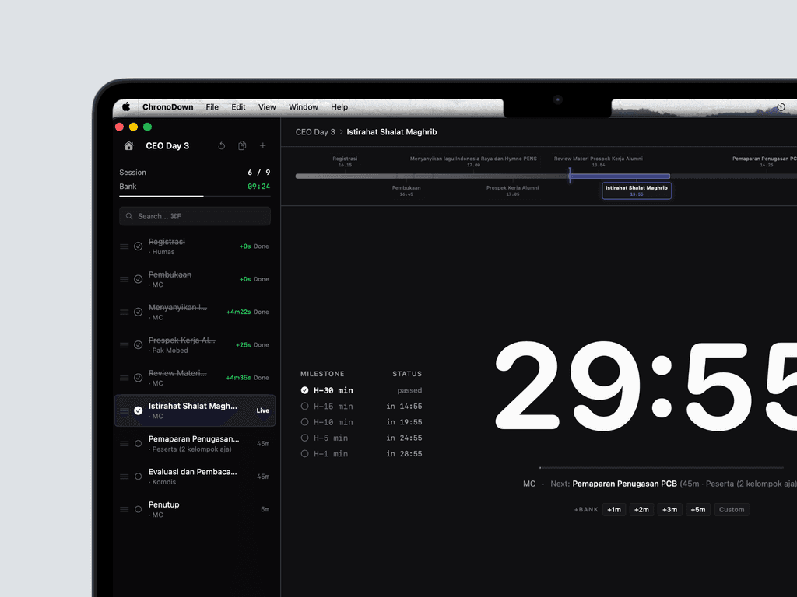
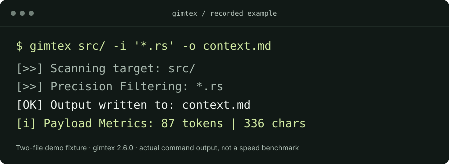

# Hey, I'm Boy.

<strong>A computer engineer with a designer's eye.</strong> I build thoughtful things—from custom circuit boards to native apps.

[Portfolio & case studies](https://feboyfierlyan.com/) · [LinkedIn](https://www.linkedin.com/in/feboyfierlyan/) · [Let's talk](mailto:boy@feboyfierlyan.com)

01 / HARDWARE + SOFTWARE

**[Nodi](https://github.com/feboyfierlyan/nodi) — a little companion, down to the circuit board.**

Custom KiCad PCB, RISC-V firmware, and an interactive 3D simulator. The same C core runs the companion's state in firmware and WebAssembly.

`C` `RISC-V` `KiCad` `WebAssembly` `Three.js`

In development · Working simulator and routed PCB · Physical validation is next

[Explore the build →](https://github.com/feboyfierlyan/nodi) · [Run the simulator](https://github.com/feboyfierlyan/nodi#coba-nodi) · [Validation notes](https://github.com/feboyfierlyan/nodi/blob/main/docs/validation.md)

Watch Nodi's firmware come to life

 

Generated by the C framebuffer renderer using sample states. This is a software preview, not footage of a physical OLED.

 

<table>
<tr>
<td width="50%" valign="top">
02 / ON-DEVICE AI
<h3>JariLingo</h3>

<strong>Learn a language with your hands.</strong>

BISINDO lessons with on-device gesture recognition. I built the ML pipeline and the iOS app.

<code>SwiftUI</code> <code>Core ML</code> <code>TensorFlow</code>

<a href="https://feboyfierlyan.com/projects/jarilingo">Read the case study →</a> <a href="projects/jarilingo.md">Engineering notes</a>

</td>
<td width="50%" valign="top">
03 / NATIVE macOS
<h3>ChronoDown</h3>

<strong>Keep the whole event on time.</strong>

A macOS event timer with sessions, overtime, and a Time Bank. Built and used at a live event.

<code>SwiftUI</code> <code>SwiftData</code> <code>AppKit</code>

<a href="https://feboyfierlyan.com/projects/chronodown">Read the case study →</a> <a href="projects/chronodown.md">Engineering notes</a>

</td>
</tr>
</table>

04 / DEVELOPER TOOLS

### [gimtex](https://github.com/feboyfierlyan/gimtex)

**From a codebase to useful context.** A Rust CLI to select source files, extract Git changes, and prepare Markdown or XML for LLM workflows—with token counts and pattern-based secret redaction.

`Rust` `CLI` `Git`

[Source & quick start →](https://github.com/feboyfierlyan/gimtex) · [Example workflow](projects/gimtex.md)

## More things I've built

- **[VillaVibe](https://github.com/feboyfierlyan/VillaVibe)** — a Flutter villa-rental app with guest and host workflows.
- **[Kohs!](https://feboyfierlyan.com/#projects)** — a mobile block-design game; featured in my portfolio.
- **[ToDoList](https://github.com/feboyfierlyan/ToDoList)** — a Flutter task app exploring fluid mobile interaction. [Design case study](https://feboyfierlyan.com/projects/todolist)
- **[Ceritakan](https://github.com/feboyfierlyan/Ceritakan)** — a web app for sharing thoughts and photos through daily prompts.
- **[LetMeCook](https://github.com/feboyfierlyan/LetMeCook)** — a Kotlin Android app for discovering recipes and exploring cuisines.
- **[Student study EDA](https://github.com/feboyfierlyan/student-study-eda)** — a reproducible exploration of study time and grades across 649 students.

## A little about me

I'm Muhammad Fierlyan Irwandi, a Computer Engineering student at PENS in Surabaya, Indonesia. I enjoy connecting the low-level details with the way a product feels to use. Outside these builds, I explore cybersecurity and embedded systems.

Have something interesting to build? **[Let's talk.](mailto:boy@feboyfierlyan.com)**
